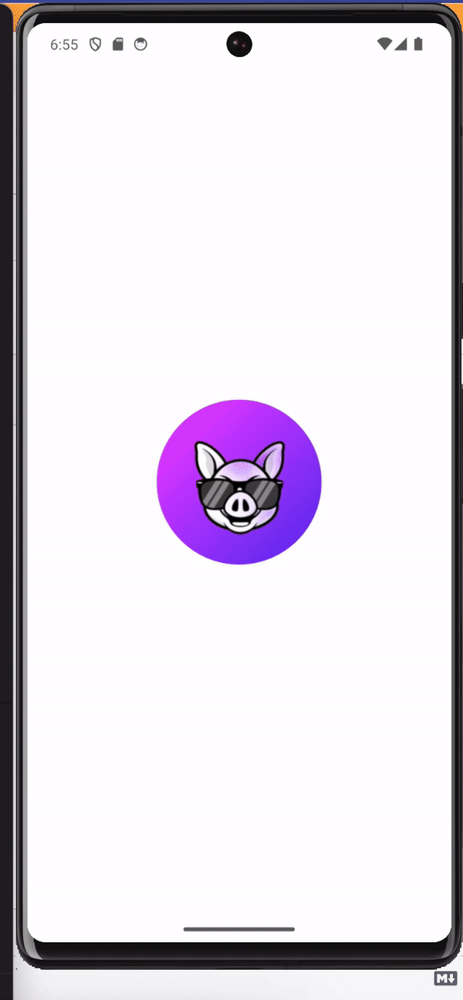

# Flutter Radio player

The objective of this flutter application about asynchronous programming in Dart II. Flutter 3.10.5
To demostrate uses of new material package flutter 3.10
To show nice animations with beautiful UI designs
To demostrate the handle of statement with provider
implement the application icon,
implement splash screen.

## To get started 
To start run the following commands 

git clone [repo_url]

flutter pub get

flutter run --dart

