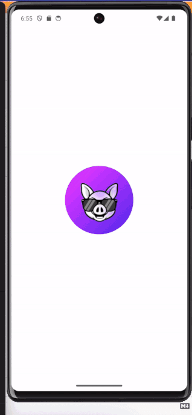

# Flutter Radio player

- The objective of this flutter application about asynchronous programming in Dart II. Flutter 3.10.5
- To demostrate uses of new material package flutter 3.10
- To show nice animations with beautiful UI designs
- To demostrate the handle of statement with provider
- implement the application icon,
- implement splash screen.
  
- ## how to manage clear architecture.
- [What is feature ?]
- A feature is a functional requirement that helps the user complete a given task.
# More information .....https://codewithandrea.com/articles/flutter-project-structure/

## To get started 
To start run the following commands 

git clone [repo_url]

flutter pub get

flutter run --dart

## Flutter packages
- [cupertino_icons]
- [provider]
- [audioplayers]
- [http: ^0.13.6]
- [flutter_secure_storage] 
- [google_fonts]
- [path_provider]
- [go_router]
- [dismissible_page]
- [lottie]
- [intl]

## API 
The api for the solution was provided by `RapiApi API`.
We’ll be focusing on one endpoint:

  -   Billboard HOT 100 music
  -  /https://rapidapi.com/LDVIN/api/billboard-api/

## For more details: - https://www.marialijideveloper.com
# Thanks ....https://www.flaticon.es/
